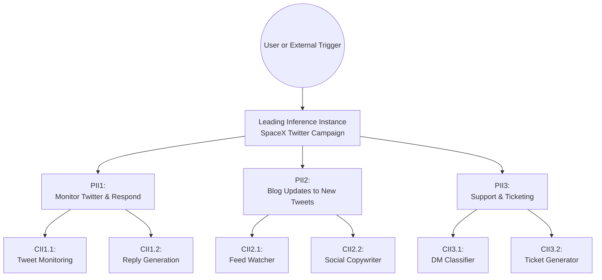

# test

flowchart TB %% Top-to-bottom hierarchy

```markup
%% Starting node (User or external trigger)
user((User or External Trigger))

%% Leading Inference Instance (LII)
LII[Leading Inference Instance\nSpaceX Twitter Campaign]

%% Parent Inference #1 (PII1)
PII1[PII1:\nMonitor Twitter & Respond]
CII11[CII1.1:\nTweet Monitoring]
CII12[CII1.2:\nReply Generation]

%% Parent Inference #2 (PII2)
PII2[PII2:\nBlog Updates to New Tweets]
CII21[CII2.1:\nFeed Watcher]
CII22[CII2.2:\nSocial Copywriter]

%% Parent Inference #3 (PII3)
PII3[PII3:\nSupport & Ticketing]
CII31[CII3.1:\nDM Classifier]
CII32[CII3.2:\nTicket Generator]

%% Connect: User triggers LII
user --> LII

%% From LII, branch to each PII
LII --> PII1
LII --> PII2
LII --> PII3

%% Under each PII, branch to each CII
PII1 --> CII11
PII1 --> CII12

PII2 --> CII21
PII2 --> CII22

PII3 --> CII31
PII3 --> CII32
```



You can publish your site and find related settings from your docs site's homepage.

<figure><figcaption></figcaption></figure>

